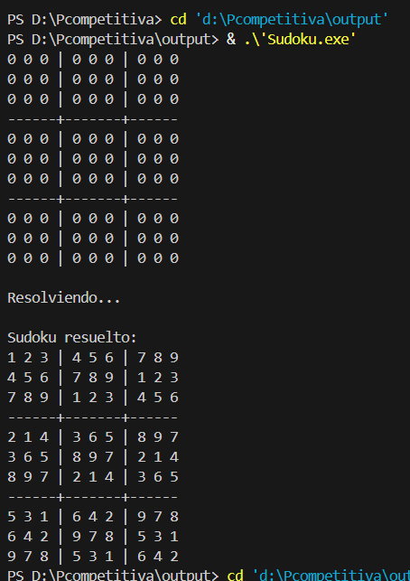

# 🧩 Sudoku Solver (Backtracking en C++)

## 📌 Descripción

Este proyecto implementa un **resolutor de Sudoku 9x9** usando el algoritmo de **Backtracking en C++**.

El programa:
- Lee un Sudoku desde un archivo de entrada
- Verifica reglas del Sudoku
- Resuelve el tablero automáticamente
- Muestra el proceso paso a paso (modo debug opcional)

---

## ⚙️ Algoritmo utilizado

El solucionador usa **Backtracking**, que funciona así:

- Busca una celda vacía (0)
- Prueba números del 1 al 9
- Verifica si es válido (`esSeguro`)
- Si funciona, continúa recursivamente
- Si falla, retrocede (backtrack)

---

## 📏 Reglas del Sudoku

El número colocado debe cumplir:

- No repetirse en la misma fila
- No repetirse en la misma columna
- No repetirse en el bloque 3x3

---

## 📥 Entrada

El archivo de entrada debe llamarse:
